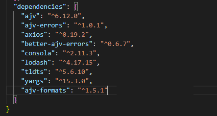

# Hostlist compiler

This is a simple tool that makes it easier to compile a [hosts blocklist](https://adguard-dns.io/kb/general/dns-filtering-syntax/) compatible with AdGuard Home or any other AdGuard product with **DNS filtering**.

- [Usage](#usage)
  - [Configuration](#configuration)
  - [Command-line](#command-line)
  - [API](#api)
- [Transformations](transformations.md)
- [How to build](#how-to-build)

## <a name="usage"></a> Usage

First of all, install the [dependencies, and build](#how-to-build).
After that you have two options.

**Using Scripts**

### `generate-filters.sh` – Compile and Save Filters

This script takes care of compiling one or more filters by invoking the compiler with the appropriate configuration and saving the output files (split or not) to the target directory.

#### What It Does

* Iterates over `.json` files in `filter-configs/`
* Runs the compiler using `cli.js`
* Outputs result(s) to `filter-list/`
* Handles file splitting if `maxsize` is defined in the config
* Automatically names output files:
  e.g., `filter-01.txt`, or `filter-01_part1.txt`, etc.

#### Use Case

Run this to regenerate all filters before committing updates or deploying them.

#### Example Usage

```bash
./scripts/generate-filters.sh
```

#### Sample Output

```
generate-filters.sh - compile all filters

Generating config-01...
✓ filter-list/filter-01.txt (138063 bytes)

Generating config-03...
✓ filter-list/filter-03_part1.txt
✓ filter-list/filter-03_part2.txt

All filters successfully generated.
```
---

### `check-modified-filters.sh` – Detect Modified Configurations

This script checks whether any filter configuration files in a specific directory have been modified (e.g., via Git), and optionally lists how many lines were changed per file.

#### What It Does

* Runs `git diff` against each config file (typically in `filter-configs/`)
* Determines which filters have been updated
* Summarizes the number of lines changed per file
* Outputs the list of changed filter configs so they can be recompiled

#### Use Case

Use this script in your CI/CD pipeline or manual process to identify which filters need regeneration after edits.

#### Example Usage

```bash
./scripts/check-modified-filters.sh
```

#### Sample Output

```
check-filters.sh - generate filters

checkin filters...

Modified filters:
  filter-configs/config-01.json (12 lines changed)
  filter-configs/config-05.json (3 lines changed)

Filters needing regeneration:
  config-01
  config-05
```


**Quick hosts conversion**

Convert and compress a `/etc/hosts`-syntax blocklist to [AdGuard syntax](https://adguard-dns.io/kb/general/dns-filtering-syntax/).

```
hostlist-compiler -i hosts.txt -i hosts2.txt -o output.txt
```

**Build a configurable blocklist from multiple sources**

Prepare the list configuration (read more about that [below](#configuration)) and run the compiler:

```bash
hostlist-compiler -c configuration.json -o output.txt
```

**All command line options**

```
Usage: hostlist-compiler [options]

Options:
  --config, -c      Path to the compiler configuration file             [string]
  --input, -i       URL (or path to a file) to convert to an AdGuard-syntax
                    blocklist. Can be specified multiple times.          [array]
  --input-type, -t  Type of the input file (/etc/hosts, adguard)        [string]
  --output, -o      Path to the output file                  [string] [required]
  --verbose, -v     Run with verbose logging                           [boolean]
  --version         Show version number                                [boolean]
  -h, --help        Show help                                          [boolean]

Examples:
  hostlist-compiler -c config.json -o       compile a blocklist and write the
  output.txt                                output to output.txt
  hostlist-compiler -i                      compile a blocklist from the URL and
  https://example.org/hosts.txt -o          write the output to output.txt
  output.txt
```

### <a name="configuration"></a> Configuration

Configuration defines your filter list sources, and the transformations that are applied to the sources.

Here is an example of this configuration:

```json
{
  "name": "List name",
  "description": "List description",
  "homepage": "https://example.org/",
  "license": "GPLv3",
  "version": "1.0.0.0",
  "sources": [
    {
      "name": "Local rules",
      "source": "rules.txt",
      "type": "adblock",
      "maxsize": "0",
      "transformations": ["RemoveComments", "Compress"],
      "exclusions": ["excluded rule 1"],
      "exclusions_sources": ["exclusions.txt"],
      "inclusions": ["*"],
      "inclusions_sources": ["inclusions.txt"]
    },
    {
      "name": "Remote rules",
      "source": "https://example.org/rules",
      "type": "hosts",
      "exclusions": ["excluded rule 1"]
    }
  ],
  "transformations": ["Deduplicate", "Compress"],
  "exclusions": ["excluded rule 1", "excluded rule 2"],
  "exclusions_sources": ["global_exclusions.txt"],
  "inclusions": ["*"],
  "inclusions_sources": ["global_inclusions.txt"]
}
```

- `name` - (mandatory) the list name.
- `description` - (optional) the list description.
- `homepage` - (optional) URL to the list homepage.
- `license` - (optional) Filter list license.
- `version` - (optional) Filter list version.
- `maxsize` - **(optional) Max Size of output file**    ***<-- Added in this repo***
- `sources` - (mandatory) array of the list sources.
  - `.source` - (mandatory) path or URL of the source. It can be a traditional filter list or a hosts file.
  - `.name` - (optional) name of the source.
  - `.type` - (optional) type of the source. It could be `adblock` for Adblock-style lists or `hosts` for /etc/hosts style lists. If not specified, `adblock` is assumed.
  - `.transformations` - (optional) a list of transformations to apply to the source rules. By default, **no transformations** are applied. Learn more about possible transformations [here](#transformations).
  - `.exclusions` - (optional) a list of rules (or wildcards) to exclude from the source.
  - `.exclusions_sources` - (optional) a list of files with exclusions.
  - `.inclusions` - (optional) a list of wildcards to include from the source. All rules that don't match these wildcards won't be included.
  - `.inclusions_sources` - (optional) a list of files with inclusions.
- `transformations` - (optional) a list of transformations to apply to the final list of rules. By default, **no transformations** are applied. Learn more about possible transformations [here](#transformations).
- `exclusions` - (optional) a list of rules (or wildcards) to exclude from the source.
- `exclusions_sources` - (optional) a list of files with exclusions.
- `.inclusions` - (optional) a list of wildcards to include from the source. All rules that don't match these wildcards won't be included.
- `.inclusions_sources` - (optional) a list of files with inclusions.

Here is an example of a minimal configuration:

```json
{
  "name": "test list",
  "sources": [
    {
      "source": "rules.txt"
    }
  ]
}
```

### Output Splitting with `maxsize`

Because havind HUGE filter files are causing AdGuard to lag, I have made it so that huge conversion are splitted in X number of files.

You can now limit the size of the compiled output using the `maxsize` field in your configuration file.

### 🔧 `maxsize` (optional)

* Specifies the **maximum size in bytes** for any output file.
* If the compiled list exceeds `maxsize`, it will be **split into multiple files**.
* Each part will be saved with the format:
  `filter-01_part1.txt`, `filter-01_part2.txt`, etc.
* If the final output is **smaller than** `maxsize`, it will be written **as-is** to the path provided via `--output`.

### Example

```json
{
  "name": "Custom Hosts - adaway",
  "description": "DNS-level compatible adblock filter",
  "homepage": "https://github.com/arsscriptum/adguard.hostlist.compiler",
  "license": "GPLv3",
  "maxsize": "614400",
  "sources": [
    {
      "name": "hosts.txt rules",
      "source": "https://adaway.org/hosts.txt",
      "type": "hosts",
      "transformations": ["RemoveModifiers", "Validate"]
    }
  ],
  "transformations": ["Deduplicate", "Compress"]
}
```

### Command

```bash
node ./src/cli.js -c ./config.json -o ./filter-list/filter-01.txt
```

### Output

If the file size exceeds `614400` bytes:

```
./filter-list/filter-01_part1.txt
./filter-list/filter-01_part2.txt
```

If it does **not exceed**:

```
./filter-list/filter-01.txt
```

Each file part includes a header with:

* File name
* Actual size
* Max allowed size


**Exclusion and inclusion rules**

Please note, that exclusion or inclusion rules may be a plain string, wildcard, or a regular expression.

- `plainstring` - every rule that contains `plainstring` will match the rule
- `*.plainstring` - every rule that matches this wildcard will match the rule
- `/regex/` - every rule that matches this regular expression, will match the rule. By default, regular expressions are case-insensitive.
- `! comment` - comments will be ignored.

### <a name="command-line"></a> Command-line

Command-line arguments.

```
Usage: hostlist-compiler [options]

Options:
  --version      Show version number                                   [boolean]
  --config, -c   Path to the compiler configuration file     [string] [required]
  --output, -o   Path to the output file                     [string] [required]
  --verbose, -v  Run with verbose logging                              [boolean]
  -h, --help     Show help                                             [boolean]

Examples:
  hostlist-compiler -c config.json -o       compile a blocklist and write the
  output.txt                                output to output.txt
```

### <a name="api"></a> API

Install: `npm i @adguard/hostlist-compiler` or `yarn add @adguard/hostlist-compiler`

#### JavaScript example:

```javascript
const compile = require("@adguard/hostlist-compiler");

;(async () => {
    // Compile filters
    const result = await compile({
        name: 'Your Hostlist',
        sources: [
            {
                type: 'adblock',
                source: 'https://adguardteam.github.io/AdGuardSDNSFilter/Filters/filter.txt', // or local file
                transformations: ['RemoveComments', 'Validate'],
            },
        ],
        transformations: ['Deduplicate'],
    });

    // Write to file
    writeFileSync('your-hostlist.txt', result.join('\n'));
})();
```

#### TypeScript example:

```typescript
import compile from '@adguard/hostlist-compiler';
import { writeFileSync } from 'fs';

;(async () => {
    // Compile filters
    const result = await compile({
        name: 'Your Hostlist',
        sources: [
            {
                type: 'adblock',
                source: 'https://adguardteam.github.io/AdGuardSDNSFilter/Filters/filter.txt',
                transformations: ['RemoveComments', 'Validate'],
            },
        ],
        transformations: ['Deduplicate'],
    });

    // Write to file
    writeFileSync('your-hostlist.txt', result.join('\n'));
})();
```

or:

```typescript
import HostlistCompiler, { IConfiguration as HostlistCompilerConfiguration } from '@adguard/hostlist-compiler';
import { writeFileSync } from 'fs';

;(async () => {
    // Configuration
    const config: HostlistCompilerConfiguration = {
        name: 'Your Hostlist',
        sources: [
            {
                type: 'adblock',
                source: 'https://adguardteam.github.io/AdGuardSDNSFilter/Filters/filter.txt',
                transformations: ['RemoveComments', 'Validate'],
            },
        ],
        transformations: ['Deduplicate'],
    };

    // Compile filters
    const result = await HostlistCompiler(config);

    // Write to file
    writeFileSync('your-hostlist.txt', result.join('\n'));
})();
```

## <a name="how-to-build"></a> How to build

You can clean everything and do a fresh install:

```bash
rm -rf node_modules package-lock.json
npm install
npm install ajv-formats@1.5.1 --legacy-peer-deps
npm install ajv@6.12.0
```



Build:
- `yarn install` - installs dependencies
- `yarn lint` - runs eslint
- `yarn test` - runs tests
- `node src/cli.js -c examples/sdn/configuration.json -o filter.txt` - runs compiler with the example configuration
